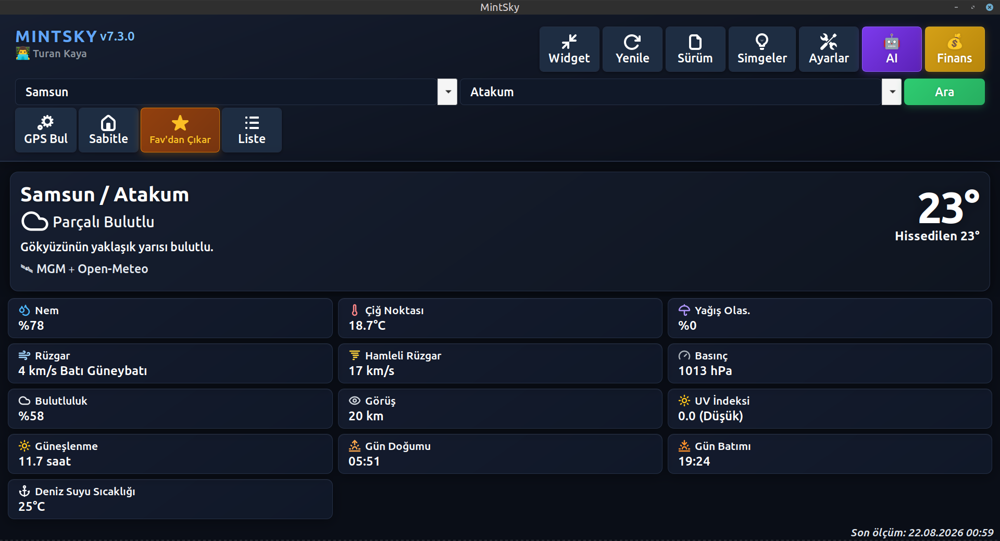
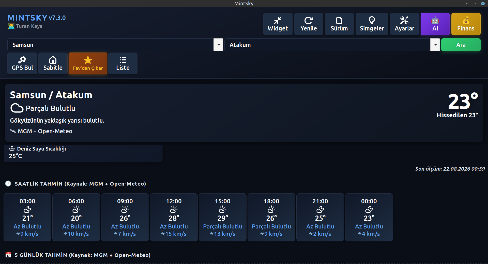
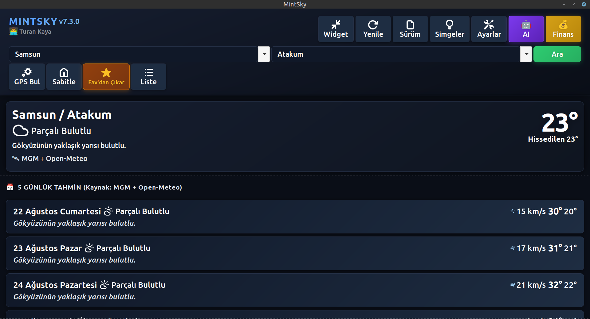
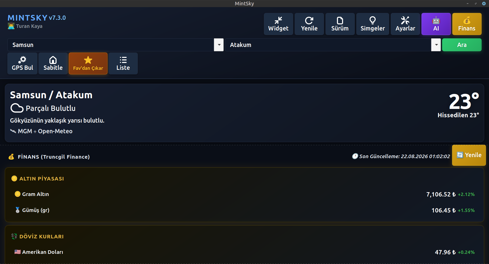

[🇬🇧 English](README_en.md)


<p align="center">
  <a href="https://github.com/tarihcituranx/mintsky/actions"></a>
  <a href="https://www.python.org/"></a>
  <a href="https://www.gtk.org/"></a>
  <a href="https://opensource.org/licenses/MIT"></a>
  <a href="https://www.linux.org/"></a>
</p>

<p align="center"></p>

MintSky, Linux masaüstü ortamları (özellikle Linux Mint, Ubuntu, Debian türevleri) için özel olarak geliştirilmiş **GTK3 tabanlı yeni nesil bir hava durumu ve asistan uygulamasıdır.** MGM (Türkiye Meteoroloji), Open-Meteo ve MSN Weather API'lerini akıllı fallback sistemiyle harmanlar. Yalnızca havayı değil; Groq LLaMA yapay zekası, Edge-TTS sesli okuma, canlı döviz/altın/kripto takibi ve portföy yönetimiyle tam donanımlı bir masaüstü asistanıdır.

## 🌟 Özellikler

### 🌦️ Hava Durumu Motoru
* **Üçlü API + Akıllı Fallback:** MGM (Türkiye resmi), Open-Meteo (global yedek) ve MSN Weather API zincirleme çalışır. Biri yanıt vermezse bir sonrakine otomatik geçer.
* **Anlık Veriler:** Sıcaklık, hissedilen, nem, basınç, rüzgar hızı/yönü/gustu, çiğ noktası, bulutluluk, görüş mesafesi.
* **UV İndeksi & Yağış:** Open-Meteo'dan anlık UV, yağış miktarı, kar verisi — birden fazla kaynaktan doğrulanır.
* **Saatlik & 5 Günlük Tahmin:** Saatlik sıcaklık, yağış olasılığı, rüzgar ve UV tahmini; 5 günlük gündüz/gece min/max grafikleri.
* **Gün Doğumu/Batımı:** Open-Meteo'dan her gün için güneş saatleri.
* **MGM Alarmları & MeteoAlarm:** Resmi meteoroloji alarmları (fırtına, sel, don, vb.) anlık olarak gösterilir. Yeni alarm çıktığında masaüstü bildirimi gelir.
* **Hava Kalitesi (AQI):** MSN API'den alınan anlık Hava Kalitesi İndeksi göstergesi.
* **Nominatim Fallback:** MGM'de kayıtlı olmayan lokasyonlar için OpenStreetMap Nominatim'den koordinat bulunur, Open-Meteo + MSN ile tahmin gösterilir.

### 🤖 Yapay Zeka & Sesli Asistan
* **Groq LLaMA AI:** "Bugün ne giymeliyim?", "Dışarı çıksam mı?" gibi havaya özel yorumlar için Groq API (LLaMA modeli) entegrasyonu. API anahtarı olmadan da çalışır (uyarı gösterir).
* **Edge-TTS Sesli Okuma:** Microsoft Edge altyapısıyla, yapay zekanın ürettiği tavsiyeyi doğal bir insan sesiyle asenkron olarak yüksek sesle okur. Sistem üzerindeki `edge-tts` CLI aracı otomatik bulunur.
* **AI Diyalog Penceresi:** Bağımsız bir pencerede mevcut hava koşullarını göstererek AI yanıtını akar-biçimde sunar.

### 💰 Canlı Finans Modülü (Truncgil Finance API)
* **Altın:** Gram Altın, Çeyrek Altın, Yarım Altın, Tam Altın, Cumhuriyet Altını, Ata Altın, Gümüş ve daha fazlası — seçilebilir.
* **Döviz:** USD, EUR, GBP, JPY, CHF, CAD, AUD, SAR, QAR, SEK, NOK ve daha fazlası — seçilebilir.
* **Kripto Altyapısı:** Bitcoin, Ethereum, Ripple, Solana ve 40+ coin için Truncgil API altyapısı hazır *(portföy UI'ına tam entegrasyon planlanıyor)*.
* **Portföy Takibi:** Altın ve döviz varlıkları için alım fiyatı girerek portföy oluşturun, anlık **kar/zarar** hesabını görün. Alım fiyatı otomatik güncel piyasa fiyatıyla doluyor.
* **2 Dakikalık Cache:** Finans verileri 120 saniyede bir yenilenir, gereksiz API yükü oluşturmaz.

### 🖥️ Arayüz & Kullanılabilirlik
* **Kompakt Widget Modu:** Tek tıkla uygulamayı masaüstü köşesine yerleşik küçük bir widget'a dönüştürün. Kompakt modda anlık sıcaklık ve 3 saatlik tahmin görünür.
* **Sistem Tepsisi (AppIndicator3 & libnotify):** Uygulamayı kapatsanız da arka planda çalışmaya devam eder. Tepsi ikonuna sağ tıklayınca anlık hava bilgisi, sol tıklayınca uygulama açılır. Mintsky, AyatanaAppIndicator3 (Ubuntu/Mint) ve standart AppIndicator3'ü otomatik algılar.
* **Masaüstü Bildirimleri:** Hava alarmı, uygulama güncellemesi ve önemli hava değişimlerinde libnotify üzerinden şık GTK bildirimleri gönderir.
* **Otomatik Başlatma (Autostart):** Ayarlardan tek tıkla açılışta başlat/durdur. `.desktop` dosyası `~/.config/autostart/` altına otomatik yazılır.
* **Uygulama Olarak Kur:** Sistem menüsüne kalıcı ikon ve `.desktop` girdisi ekler (`/usr/share/applications/`).
* **Otomatik Güncelleme Kontrolü:** Başlangıçta GitHub'daki son sürümle karşılaştırır; yeni sürüm varsa banner gösterir ve tek tıkla güncelleme yapar.
* **Favoriler:** Sık kullandığınız şehirleri favorilere ekleyip tek tıkla yükleyebilirsiniz.
* **Cache Sistemi:** Hava verisi `WEATHER_CACHE_TTL` boyunca önbellekte tutulur, pencere boyutlandırma/tekrar açma anında yüklenir.
* **Klavye Kısayolları:** `Ctrl+R` ile yenile, `Ctrl+W` ile kapat ve daha fazlası.
* **Lucide SVG İkonlar & GTK3 Tema Uyumu:** Masaüstü temanıza (karanlık/aydınlık) %100 uyumlu native GTK3 çizimi.

### 🌐 Çoklu Dil (i18n)
Arayüzdeki tüm metinler JSON tabanlı dil dosyalarına bağlıdır. Şu an **Türkçe** ve **İngilizce** tam desteklidir (Almanca, Fransızca, Arapça, Farsça, Çince, Azerbaycan Türkçesi altyapısı mevcut). Ayarlardan anında dil değiştirilebilir.

### ♿ Erişilebilirlik (A11y)
GTK3'ün yerleşik erişilebilirlik altyapısı devrededir. Orca gibi ekran okuyucularla temel klavye desteği mevcuttur.

### 🔐 Güvenlik
* API anahtarları (Groq) sistem **keyring**'ine şifreli olarak kaydedilir, hiçbir zaman JSON ayar dosyasına yazılmaz.
* MSN API kimlik bilgileri ortam değişkenlerinden (`MSN_API_KEY`, `MSN_APP_ID`) okunur — kaynak kodda sabit değer yok.

---

## 📸 Ekran Görüntüleri

<p align="center">
  
  
</p>
<p align="center">
  
  
</p>

---

## ⚙️ Kurulum & Çalıştırma

### 1. Sistem Bağımlılıkları (Debian / Ubuntu / Linux Mint)
```bash
sudo apt update
sudo apt install python3 python3-pip python3-gi python3-gi-cairo \
  gir1.2-appindicator3-0.1 gir1.2-notify-0.7 libnotify-bin
```
> **Ubuntu 22.04+ / Linux Mint 22+** kullanıyorsanız `gir1.2-appindicator3-0.1` yerine `gir1.2-ayatanaappindicator3-0.1` gerekebilir. Kod her ikisini de otomatik algılar.

### 2. İndirme ve Kurulum
```bash
git clone https://github.com/tarihcituranx/mintsky.git
cd mintsky
pip3 install . --break-system-packages
```
Bu komut `requirements.txt` üzerinden `requests`, `PyGObject`, `groq`, `edge-tts` ve `keyring` paketlerini otomatik kurar.

*(Not: `--break-system-packages` yerine daha güvenli bir yöntem için `pipx install .` veya `python3 -m venv .venv && source .venv/bin/activate && pip install .` kullanabilirsiniz.)*

### 3. Başlatma
```bash
mintsky
# veya masaüstü widget modunda:
mintsky --autostart
```

---

## 🛠️ Yapılandırma

| Ayar | Nasıl? |
|---|---|
| **Groq API Anahtarı** | `Ayarlar → 🤖 AI` sekmesinden ücretsiz [Groq API Key](https://console.groq.com/keys) girin. Keyring'e şifreli kaydedilir. |
| **Konum Sabitleme** | Şehir arayıp "⭐ Sabitle" butonuna basın — her açılışta o konum yüklenir. |
| **Finans Paneli** | `Ayarlar → 💰 Finans` sekmesinden gösterilecek altın, döviz ve kripto seçin. |
| **Dil** | `Ayarlar → ⚙️ Sistem` sekmesinden TR / EN seçimi. |
| **Otomatik Başlatma** | `Ayarlar → ⚙️ Sistem` sekmesindeki toggle ile açılışta başlatın. |
| **MSN API** | `MSN_API_KEY` ve `MSN_APP_ID` ortam değişkenlerini ayarlayın (isteğe bağlı). |

---

## 🚀 Yol Haritası (Planlanan Özellikler)

* **Bukalemun Hibrit Mimari:**
  * GNOME ve Fedora kullanıcıları için native **GTK4/Libadwaita** desteği.
  * Windows ve macOS kullanıcıları için **çapraz platform arayüz (PyQt/Tkinter)** desteği — işletim sistemine göre native arayüz otomatik yüklenir.

---

## 💻 Teknoloji Yığını

| Teknoloji | Tür | Açıklama |
| :--- | :--- | :--- |
| **Python 3.10+** | Ana Dil | Asenkron arka plan görevleri, thread pool |
| **GTK3 (PyGObject)** | Arayüz | Native Linux GUI, AppIndicator3, libnotify |
| **Groq (LLaMA)** | LLM | Üst düzey hızda hava analizi yapan yapay zeka |
| **Edge-TTS** | TTS | Microsoft altyapılı asenkron sesli okuma |
| **MGM API** | Hava | Türkiye resmi meteoroloji verileri + alarm + meteoalarm |
| **Open-Meteo** | Hava (yedek) | UV, saatlik & 5 günlük tahmin, gün doğumu/batımı |
| **MSN Weather** | Hava (ekstra) | AQI, gerçek zamanlı hissedilen sıcaklık |
| **Nominatim (OSM)** | Geocoding | MGM'de kayıtsız konumlar için koordinat çözümleme |
| **Truncgil Finance** | Finans | Gerçek zamanlı altın, döviz, kripto pariteler |
| **keyring** | Güvenlik | API anahtarlarını şifreli sistem deposunda saklar |
| **Pytest & GitHub Actions** | Test & CI | Mock tabanlı senaryo testleri, bandit güvenlik taraması |

---

## 🤝 Katkıda Bulunma

MintSky herkesin katılımına açıktır. Yeni özellik, dil dosyası veya hata düzeltmesi için [Pull Request](https://github.com/tarihcituranx/mintsky/pulls) açabilirsiniz.

> **Yasal Uyarı:** MintSky test amaçlı geliştirilmiş bir uygulamadır; API verilerinden kaynaklanabilecek aksaklıklar için sorumluluk kabul edilmez. Linux Mint 22.3 "Zena" üzerinde geliştirilmiştir, bağımlılıkları karşılayan tüm modern GTK3 destekli dağıtımlarda çalışır.


